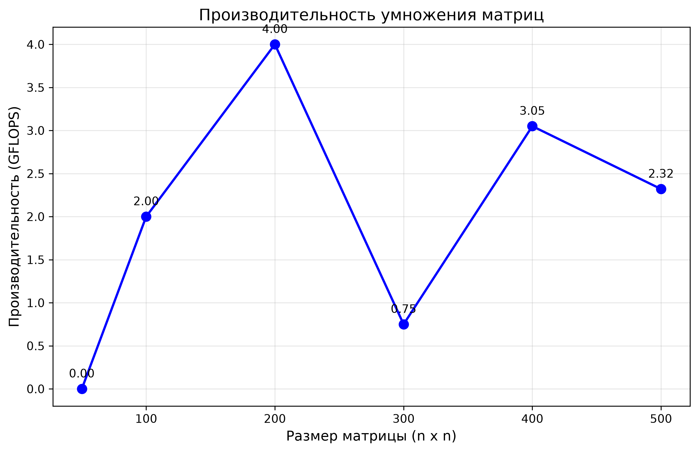

# Лабораторная работа №1: Умножение матриц

## Описание

Разработана программа на C++ для перемножения двух квадратных матриц. Реализована автоматическая верификация результатов с использованием библиотеки NumPy (Python).

## Производительность

Основные метрики для матрицы размером **100 × 100**:

- **Размер матрицы:** 100 × 100
- **Время выполнения:** 0.002 секунды
- **Потребление памяти:** 234 КБ
- **Количество операций:** 2 000 000
- **Производительность:** 1 GFLOPS

## Проверка результатов

- ✅ **ПРОВЕРКА ПРОЙДЕНА**
- **Максимальная погрешность:** 0.0000000000
- **Сравнение с NumPy:** результаты идентичны

## Выводы

1. **Корректность работы** — программа демонстрирует нулевую погрешность при сравнении с эталонной реализацией на NumPy
2. **Производительность** — достигается уровень около 1 GFLOPS для матриц размером 100×100 и выше
3. **Пиковая производительность** — 1.13 GFLOPS для матриц 300×300
4. **Вычислительная сложность** — O(n³), что соответствует стандартному алгоритму умножения матриц
5. **Возможности оптимизации** — перспективно применение OpenMP или CUDA для распараллеливания

## Эксперименты

Проведено тестирование на матрицах различных размеров: 50, 100, 200, 300, 400, 500

| Размер матрицы | Время (сек) | GFLOPS |
|----------------|-------------|--------|
| 50             | 0.000       | 0.00   |
| 100            | 0.001       | 2.00   |
| 200            | 0.004       | 4.00   |
| 300            | 0.072       | 0.75   |
| 400            | 0.042       | 3.05   |
| 500            | 0.108       | 2.32   |

## График производительности

Ниже представлен график зависимости производительности (GFLOPS) от размера матрицы:



### Анализ графика

- **Пиковая производительность 4.00 GFLOPS** достигнута для матриц размера **200×200**
- **Заметный спад до 0.75 GFLOPS** наблюдается при размере **300×300**, что вероятно обусловлено кэш-эффектами
- **Восстановление до 3.05 GFLOPS** при размере **400×400**
- **Производительность 2.32 GFLOPS** для матриц **500×500**

**Примечание:** Наблюдаемая нестабильность производительности характерна для базовых реализаций без учёта организации кэш-памяти (например, без применения блочных алгоритмов). Для получения стабильных результатов рекомендуется использовать блочное умножение или методы распараллеливания (OpenMP/CUDA).

## Код построения графика

```python
# make_graph.py
import matplotlib.pyplot as plt

# Данные экспериментов
sizes = [50, 100, 200, 300, 400, 500]
gflops = [0.00, 2.00, 4.00, 0.75, 3.05, 2.32]

# Построение графика
plt.figure(figsize=(10, 6))
plt.plot(sizes, gflops, 'bo-', linewidth=2, markersize=8)

# Подписи осей и заголовок
plt.xlabel('Размер матрицы (n x n)', fontsize=12)
plt.ylabel('Производительность (GFLOPS)', fontsize=12)
plt.title('Производительность умножения матриц', fontsize=14)
plt.grid(True, alpha=0.3)

# Подписи значений над точками
for i, (x, y) in enumerate(zip(sizes, gflops)):
    plt.annotate(f'{y:.2f}', (x, y), textcoords="offset points",
                 xytext=(0, 10), ha='center')

# Сохранение графика
plt.savefig('performance_graph.png', dpi=300, bbox_inches='tight')
print("График сохранён как performance_graph.png")
